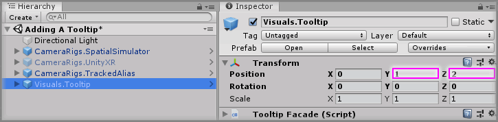
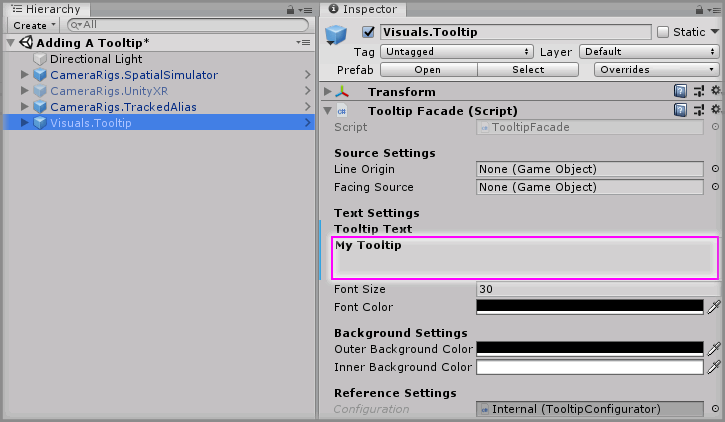
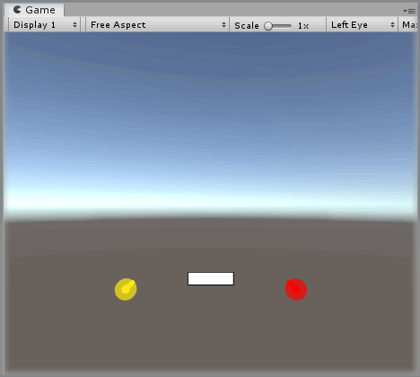
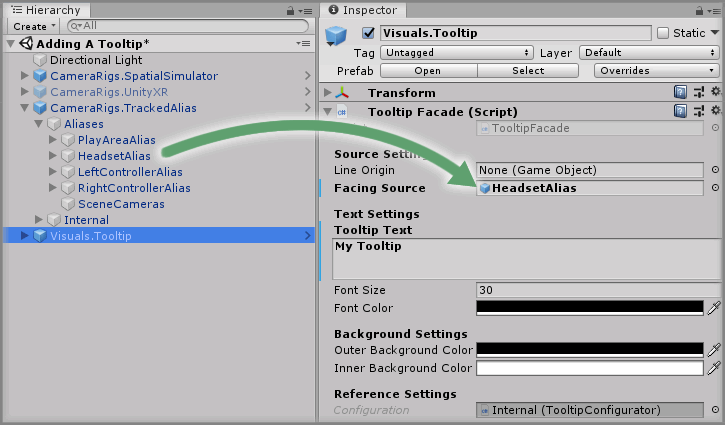
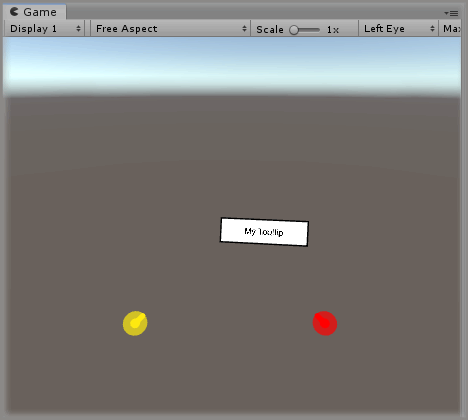
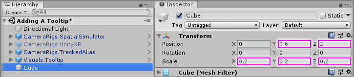
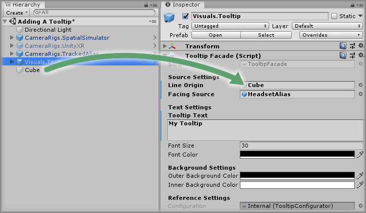
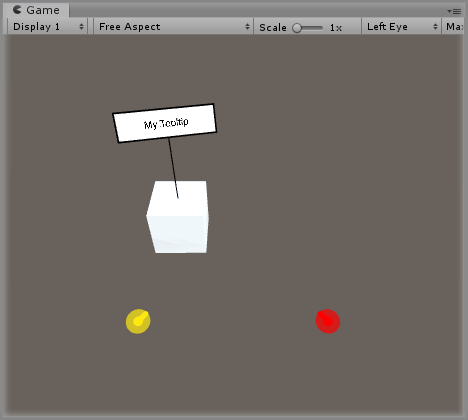

# Adding A Tooltip

> * Level: Beginner
>
> * Reading Time: 5 minutes
>
> * Checked with: Unity 2018.3.14f1

## Introduction 

The `Visuals.Tooltip` prefab a way of showing informative spatial text in a [Unity] scene and can be anchored to a GameObject to allow it to specifically reference individual objects.

## Prerequisites

* [Add the Tilia.CameraRigs.TrackedAlias.Unity -> CameraRigs.TrackedAlias] prefab to the scene hierarchy.
* [Install the Tilia.Visuals.Tooltip.Unity] package dependency in to your Unity project.

## Let's Start

### Step 1 

Add a `Visuals.Tooltip` prefab to the Unity project hierarchy by selecting `GameObject -> Tilia -> Prefabs -> Visuals -> Visuals.Tooltip` from the Unity main top menu.

Change the `Visuals.Tooltip` GameObject Transform properties to:

* Position: `X = 0, Y = 1, Z = 2`

### Step 2

Select the `Visuals.Tooltip` GameObject from the Unity Hierarchy window and on the `Tooltip Facade` component change the `Tooltip Text` property value to `My Tooltip`.

Play the Unity scene and you will see the tooltip in front of you but no text. This is because the tooltip is facing away from you.

### Step 3

We could resolve this by simply rotating the `Visuals.Tooltip` GameObject around the `Y Axis` by `180` to ensure it faces us.

But this will also mean the Tooltip only faces us when we're looking at it in this specific position. What would be better is if the Tooltip rotates automatically so it is always facing us.

We can achieve this by expanding `CameraRigs.TrackedAlias -> Aliases` and dragging and dropping the `HeadsetAlias` GameObject into the `Facing Source` property on the `Tooltip Facade` component within the `Visuals.Tooltip` GameObject.

Play the Unity scene and you will now see that the tooltip faces you regardless of which position and orientation you are in looking towards it.

### Step 4

We can also attach our Tooltip to a Scene GameObject so it draws a line from the Tooltip to the GameObject we've selected.

Create a new `Cube` Unity 3D Object by selecting `Main Menu -> GameObject -> 3D Object -> Cube` and change the Transform properties to:

* Position: `X = 0, Y = 0.6, Z = 2`
* Scale: `X = 0.2, Y = 0.2, Z = 0.2`

### Step 5

Drag and drop the `Cube` GameObject into the `Line Origin` property on the `Tooltip Facade` component within the `Visuals.Tooltip` GameObject.

### Done

Play the Unity scene and you'll see the tooltip facing you but now with a line anchoring it to the `Cube` GameObject that was set as the `Line Origin`.

[Unity]: https://unity3d.com/
[Add the Tilia.CameraRigs.TrackedAlias.Unity -> CameraRigs.TrackedAlias]: https://github.com/ExtendRealityLtd/Tilia.CameraRigs.TrackedAlias.Unity/tree/master/Documentation/HowToGuides/AddingATrackedAlias/README.md
[Install the Tilia.Visuals.Tooltip.Unity]: ../Installation/README.md